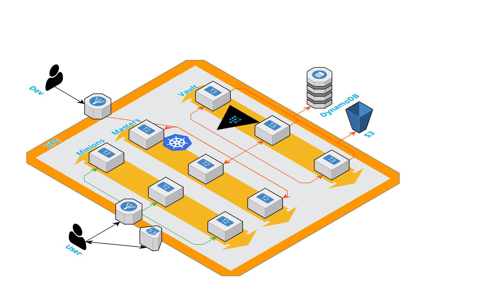
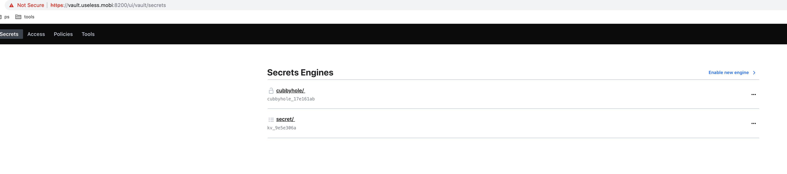
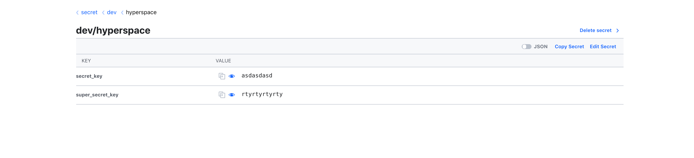

# Securing Kubernetes

## Intro
Hi y'all! It's been way too way too long since I last wrote anything. I might list a bunch reasons for the  long silence (among other things, I've found myself painting miniatures again - awesome!), but that's probably not interesting to anybody so let's get down to business shall we? 

On this occasion, we'll be looking into a pretty jucy topic. We're going to marry HashiCorp's Vault With a Kubernetes cluster for the purpose of serving (dynamic) secrets from Vault.

## Disclaimer

I'm not going to teach how to use the different tools that I've used setting up the experiment below. That would be tedious to read and to write.

## So what is Vault?

> HashiCorp Vault is a tool for securely accessing secrets. A secret is anything that you want to tightly control access to, such as API keys, passwords, or certificates. Vault provides a unified interface to any secret, while providing tight access control and recording a detailed audit log.

So in short, it's a one-stop-shop for all your secrets handling needs. For example, just imagine the hazzle of renewing SSL certificates for an internal load balancer in AWS. The internal CA service that ACM offers is great, but it does come with a cost of 400$ (last I checked) a month which is quite expensive.

With Vault, you get a single API to renew, fetch and revoke your certificates - so no more `openssl <try to remember the commands you use once a year>`. Now you can easily write a small program (read: lambda handler) to renew your certificates for a fraction of the cost of an ACM provisioned internal CA. 

Today though, we're interested in injecting key-value pairs to containers being spun on a Kubernetes cluster. Normally people use the secrets API of Kubernetes to store and serve secrets as environment variables. Now this approach is completely fine, but you really should take care of encrypting ETCDs disks and limit access to the secrets API if you take this route, and most people do.

Using Vault however, to provision and store your secrets, is more operator and especially developer friendly IMO. "Why?" You might ask. Well firstly, secrets are only ever store encryted, even if the storage being used is not. Vault takes care, that nothing leaves its security boundary decrypted. It also takes care of decrypting when secrets are read from Vault. Another thing is easy IAM. Setting up fine-grained access policies is really simple. For example, here's the Kubernetes service account policy I made for this exercise:
```
path "secret/*" {
  capabilities = [ "read", "list" ]
}

path "sys/leases/renew" {
  capabilities = ["create"]
}
path "sys/leases/revoke" {
  capabilities = ["update"]
}
```
Easy!

For developers, Vault offers a single API endpoint for all of their secrets needs, including PKI certificates, cloud accounts etc. And the best part? Everything is auditable, TTL stamped and operator controlled.

So let's get cracking to see Vault in action.

## Setting the environment

In this chapter, we setup a highly available Kubernetes and Vault clusters in AWS. You can follow along, but take note that I'm using a registered public domain for ease of use. You'll need to either fork and adjust some parameters in the repo or get yourself a public domain to follow along.

### Prerequisites
* Kubectl.
* Helm.
* Ansible.
* Terraform.
* Packer.
* Kops.
* Vault CLI (optional).
* AWS CLI (optional).
* Pre-create SSH keys and output them to the appropriate directories, for example: `ssh-keygen -t rsa -b 4096 -C "key@vault" -f keys/vault/vault_rsa`. Do the same for `kubernetes_rsa`. 

### Topology



### Step-by-step

1. **Bootstrap the Terraform state**

This will provision a S3 bucket and a DynamoDB table for Terraform remote state handling 
```
./bootstrap.sh default eu-west-1
```
2. **Setup basic networking**

For this step, you'd be best to comment out `vault.tf` and `kubernetes.tf`. The latter will be rewritten soon. 
```
terraform init # If this doesn't work, check backend in main.tf
terraform plan # Check that output looks good
terraform apply -auto-approve
```
If everything went okay, you should see subnet IDs and a VPC ID in the output something like: 

```
all_subnet_ids = [
    subnet-093e9b3ab369ce081,
    subnet-0543b5d10bd887a5b,
    subnet-0a2497254954840d4,
    subnet-06b1d6094b71fed3d,
    subnet-01f0757b77ef3d4e1,
    subnet-0f34944d2f036c22b
]
hyperspace_rep_arn = arn:aws:ecr:eu-west-1:772545774134:repository/hyperspace
private_subnet_ids = [
    subnet-0a2497254954840d4,
    subnet-06b1d6094b71fed3d,
    subnet-0f34944d2f036c22b
]
utility_subnet_ids = [
    subnet-093e9b3ab369ce081,
    subnet-0543b5d10bd887a5b,
    subnet-01f0757b77ef3d4e1
]
vpc_id = vpc-07c93b78357bb8450
```

3. **Packer build the Vault AMI**

Next, let's create the AMI that will be used for Vault instances. Copy paste one of the utility subnet IDs to the Packer template: 
```
    "aws_region": "eu-west-1",
    "subnet_id": "subnet-093e9b3ab369ce081",    <=======HERE
    "consul_download_url": "{{env `CONSUL_DOWNLOAD_URL`}}",
```
And then, run:
```
packer build -only=amazon-linux-ami vault-consul-ami/vault-consul.json 
```
Take note of the build AMI ID, as we will need it soon. Now, let's provision the Kubernetes cluster. I'll be using KOPS and a ready-made bash script I wrote that incorporates output variables from Terraform.

4. **Provision stuff**

```
./create-k8s.sh
```
The script automatically exports a `kubernetes.tf` template and data directory with ASG launch configurations and AWS roles and policies. You'll want to comment out at least the `provider` block and the `vpc_id` output block as they overlap with `vpc.tf`, but personally I also commented out all the network related outputs because of redundancy. They're already being output in the `vpc.tf` template. 

Now, if you run: 

```
terraform plan
terraform apply -auto-approve
```
You should have a functional Kubernetes cluster with three masters and three minions divided into three AZs.
```
$ kubectl cluster-info

Kubernetes master is running at https://api.vault-demo.useless.mobi
KubeDNS is running at https://api.vault-demo.useless.mobi/api/v1/namespaces/kube-system/services/kube-dns:dns/proxy

To further debug and diagnose cluster problems, use 'kubectl cluster-info dump'.
```
```
$ kubectl get nodes -o wide

NAME                                        STATUS   ROLES    AGE   VERSION   INTERNAL-IP   EXTERNAL-IP   OS-IMAGE                       KERNEL-VERSION   CONTAINER-RUNTIME
ip-90-80-1-194.eu-west-1.compute.internal   Ready    node     12m   v1.11.6   90.80.1.194   <none>        Debian GNU/Linux 9 (stretch)   4.9.0-7-amd64    docker://17.3.2
ip-90-80-1-37.eu-west-1.compute.internal    Ready    master   14m   v1.11.6   90.80.1.37    <none>        Debian GNU/Linux 9 (stretch)   4.9.0-7-amd64    docker://17.3.2
ip-90-80-2-121.eu-west-1.compute.internal   Ready    node     13m   v1.11.6   90.80.2.121   <none>        Debian GNU/Linux 9 (stretch)   4.9.0-7-amd64    docker://17.3.2
ip-90-80-2-230.eu-west-1.compute.internal   Ready    master   14m   v1.11.6   90.80.2.230   <none>        Debian GNU/Linux 9 (stretch)   4.9.0-7-amd64    docker://17.3.2
ip-90-80-3-186.eu-west-1.compute.internal   Ready    node     12m   v1.11.6   90.80.3.186   <none>        Debian GNU/Linux 9 (stretch)   4.9.0-7-amd64    docker://17.3.2
ip-90-80-3-204.eu-west-1.compute.internal   Ready    master   14m   v1.11.6   90.80.3.204   <none>        Debian GNU/Linux 9 (stretch)   4.9.0-7-amd64    docker://17.3.2
```
**Just as a side note**, *you don't need to provision your environment like I have. Using a managed service like EKS is probably best for practise sake. We're not really interested in setting up the environment, only about using Vault with Kubernetes.* 

That said, I do personally like emulate stuff as much production ready as I can. You never step into (all) the pitfalls if you play it safe. Doing the work at this point saves a lot down the road for sure. 

Just a couple of steps more to get everything up and running. Next, we provision Vault. Uncomment the template if you haven't already, input the AMI ID from previous step and modify the allowed SSH CIDR for the correct address of the bastion node. Then run: 
```
terraform init
terraform plan
terraform apply -auto-approve
```

5. **Configure Vault and Kubernetes**

First, provision a couple of "helper" stuff to Kubernetes: 
```
$ kubectl apply -f kubernetes/

configmap/kube-dns created
serviceaccount/tiller created
clusterrolebinding.rbac.authorization.k8s.io/tiller created
clusterrolebinding.rbac.authorization.k8s.io/role-tokenreview-binding created
serviceaccount/vault-handler created
```
Especially the `vault-handler` service account is of interest here. We need it to authenticate with Vault. Now, to actually connect to Vault UI, which is accessable (only) internally inside our VPC, we will install a OpenVPN server to our cluster. For this, you'll need Helm and the OpenVPN chart. Remember to go through the default settings. I personally used the `custom-value.yaml`.


Then fetch the SA token and cert like this:
```
VAULT_SA_NAME=$(kubectl get sa vault-handler -o jsonpath="{.secrets[*]['name']}")
kubectl get secret $VAULT_SA_NAME -o jsonpath="{.data.token}" | base64 --decode; echo
kubectl get secret $VAULT_SA_NAME -o jsonpath="{.data['ca\.crt']}" | base64 --decode; echo
```

Modify correct IPs for the vault-nodes in `ssh.config` and Ansible `inventory` file. SSH yourself into a Vault node and initialize your Vault cluster: `vault operator init`. **This will be the only time that Vault outputs the unseal keys, so take care of them!!!** Ideally, you should distribute the keys among five different people, but for the purpose of this exercise, I'll copy paste the output to Ansible Vault. As you probably figured out already, we will be using Ansible to do SSH stuff (this is what I generally like to do), because all manual labor is evil.


Add the unseal keys, service account token and root CA certificate to `vault-nodes.yml` as follows:
```
unseal_key_1: ***
unseal_key_2: ***
unseal_key_3: ***
unseal_key_4: ***
unseal_key_5: ***

initial_root_token: ******

k8s:
  - k8s_sa_user_token: **********
    k8s_ca_cert: |
      -----BEGIN CERTIFICATE-----
      MIIC0zCCAbugAwIBAgIMFYFTuSjo/DBYoCUJMA0GCSqGSIb3DQEBCwUAMBUxEzAR
      BgNVBAMTCmt1YmVybmV0ZXMwHhcNMTkwMjA2MDc0MzIxWhcNMjkwMjA1MDc0MzIx
      WjAVMRMwEQYDVQQDEwprdWJlcm5ldGVzMIIBIjANBgkqhkiG9w0BAQEFAAOCAQ8A
      MIIBCgKCAQEArk1SRdgbOhk3aUNW1/KUQ5vOI7sjgecV1ipZg2HaTL0p8pcBVqwv
      qBkWJhB3xlCxlRKBU/RyAoK3waB8qZD109fAYggd42+GF8iBBdu2Itr/9rlBaeKI
      lL7N2JcAwCzk1asE0R1t2+G3bqaxcOYQJ/oEEjwNykDAg5Kjf8NafebFs+Os1TIr
      RbsCbxuzZc1+xEh4BbrgVLk6Pg8HcBIxJ5gGcGbsDOUD8JD/l+jqRfkbwql+eDoJ
      4sdgu5dnT6Ug1riG5nmnFXMugAjBiLGE6B1MVN8KxvF/FfFVnEZ/SEjOi7DF9iYh
      AaLAlvE0EP66NNNVgIFYOjWKBjl68P0CeQIDAQABoyMwITAOBgNVHQ8BAf8EBAMC
      AQYwDwYDVR0TAQH/BAUwAwEB/zANBgkqhkiG9w0BAQsFAAOCAQEAlX5YkrCAJgMj
      otM4lDqZXYm8lKMW22/CaDs5wSDCWd6H7dtfiYB5v8NT5+IEvWnzVFvcSJb9MWRO
      18uJlsWF+tVm9upfmtX/Z1ZqTcieyeaMIC15Ig/Qji6hTVHF8K8DEsLktdpUIGBM
      Oe8gdEgQgEseVmWWXeIaQf2yY36vuo1bLf9VLr3WVs9MRj8RffX9eycDwySHK7Ie
      nVBrKJgDaLRRicrQNLsNRRYIddGYQhcp6AK3b/qd9GOlXtTvKvr2mZX3HOi0CpDl
      iNGZOPFByjaYEY/9YIjW3PcyrhAUGI9L6J1hHYJw8Btl6YbgAFbo84F8CIeNzmr5
      EDbDl2r9CA==
      -----END CERTIFICATE-----
    k8s_host: https://api.internal.vault-demo.useless.mobi:443
```
And then run the playbook:
```
ansible-playbook -i inventory -l vault-nodes -t vault vault.yml --vault-password-file vault_pass
```

Final step is to add a DNS record to Route53 for Vault and volá, we've got a live (production ready) Vault up and running. 



The absolute last thing to do, is to open access for Vault to talk with Kubernetes. For that I'm adding the below AWS Security Group Rule configuration block to the `kubernetes.tf` template (anywhere in the template is fine).
```
resource "aws_security_group_rule" "https-vault-to-master" {
  type                     = "ingress"
  security_group_id        = "${aws_security_group.masters-vault-demo-useless-mobi.id}"
  source_security_group_id = "${module.vault_cluster.security_group_id}"
  from_port                = 443
  to_port                  = 443
  protocol                 = "tcp"
}
```

### To use secrets from Vault

So now, we've finally at a point where we can see some Vault magic. I've got a demo application ready made, if you don't feel like using your own. There are a couple of points to note. Firstly, I'm adding an init container to the Kubernetes deployment manifest that fetches application secrets from Vault and writes them to disk that the parent container also maps.

```
spec:
  serviceAccountName: vault-handler
  initContainers:
    - name: vault-init
      image: everpeace/curl-jq
      command:
        - "sh"
        - "-c"
        - >
          KUBE_TOKEN=$(cat /var/run/secrets/kubernetes.io/serviceaccount/token);
          curl -k --request POST --data '{"jwt": "'"$KUBE_TOKEN"'", "role": "k8s-admin"}' https://vault.useless.mobi:8200/v1/auth/kubernetes/login | jq -j '.auth.client_token' > /etc/vault/token;
          X_VAULT_TOKEN=$(cat /etc/vault/token);
          curl -k --header "X-Vault-Token: $X_VAULT_TOKEN" https://vault.useless.mobi:8200/v1/secret/dev/hyperspace > /opt/secrets/secrets.json;
          for i in $(cat /opt/secrets/secrets.json | jq -r '.data | keys[]'); do
            echo "Export env: $i"
            echo "export $(echo $i | awk '{print toupper($0)}')=$(cat /opt/secrets/secrets.json | jq -r .data.$i)" >> /opt/secrets/.env
          done
      volumeMounts:
        - name: app-creds
          mountPath: /opt/secrets
        - name: vault-token
          mountPath: /etc/vault
```

So I fetch the secrets to a json dump, parse it to an environment variable file that I then source in the Dockerfile:

```
FROM golang:1.11.5-alpine
RUN apk update && apk add git 
WORKDIR /opt/app
ADD . .
RUN touch /tmp/server.pid && \
    go get github.com/gorilla/websocket && \
    go get github.com/lucasb-eyer/go-colorful && \
    cd server && \
    go build

EXPOSE 9393
ENTRYPOINT [ "sh", "-c", ". /opt/secrets/.env && env | grep SECRET && ./server/server -port 9393 echo $$! > /tmp/server.pid" ]
```
Logs should show the current values:
```
$ kubectl logs hyperspace-56fd89dbbd-w2j76

SECRET_KEY=aoTieyaezoh8
SUPER_SECRET_KEY=chu5iePak2Em
```
Now go and change the secret values of said environment variables in Vault.



And kick the pod `kubectl delete pods hyperspace-56fd89dbbd-w2j76`. Wait the new pod come to life and check logs.

```
k logs hyperspace-56fd89dbbd-gdtwr

SECRET_KEY=asdasdasd
SUPER_SECRET_KEY=rtyrtyrtyrty
```

Yey! It worked!

Before you go, please remember to delete everything `terraform destroy -auto-approve` :) 


### TL;DR

Kubernetes secrets is a mediocre solution at best, Vault is better but way more complex to setup. Choosing the best option is always a case-by-case call.

If you need help with Amazon, Kubernetes or Vault or just interested in anything CNCF has to offer, don't hesitate to contact your friendly neighborhood DevOps company! 